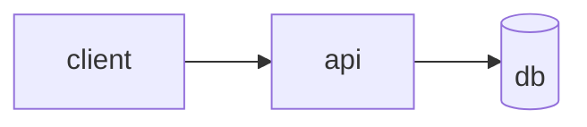

# Asset coaching

The README devices that matter most (screenshots, demo GIFs, diagrams) are exactly the things the
skill must not fabricate. So split assets three ways by what the skill can honestly do:

- **Scaffold** the scriptable (generate text the user runs to produce a real asset).
- **Coach** the visual (a checklist for assets only the user's eyes/environment can produce).
- **Verify** the runnable (run real code, capture real output — see `references/verify-code.md`).

Never reference an asset file that doesn't exist. A device that needs a missing asset becomes a TODO
plus the scaffold to produce it (`references/fabrication.md`).

## Scaffold — generate as text, zero fabrication risk

### Terminal GIFs via VHS

A VHS (`charmbracelet/vhs`) `.tape` is a declarative script the user renders with `vhs demo.tape`.
Write it from the repo's **real** commands. Offer one hero tape, or per-command tapes (the gum pattern).

```tape
# demo.tape — render with: vhs demo.tape
Output docs/assets/demo.gif
Set FontSize 18
Set Width 1200
Set Height 600
Type "mytool --help"
Enter
Sleep 3s
```

A starter lives at `scripts/templates/demo.tape`. Embed the result:
` running --help" width="600">` (or wrap in `<kbd>`).

### App screenshots via a capture script

For product/app repos, scaffold a Playwright script that drives the real app and shoots the hero flow
in **both** color schemes — real pixels, not a mockup. Template: `scripts/capture-screenshots.mjs`.
Adapt the URL and selectors to the repo; the user runs it. Then emit a theme-aware `<picture>`
(`references/helpers.md`).

### Diagrams via Mermaid

For architecture/flow diagrams, prefer Mermaid — it renders natively on GitHub, is theme-aware
automatically, and stores no binary asset to drift. Only describe structure the repo actually has.



Flag when a diagram would help (a multi-service architecture described only in prose) and offer the
Mermaid block.

## Coach — checklists for assets only the user can produce

When an asset needs the user's eyes or environment, don't fake it — give a checklist and a TODO.

**Screenshot checklist:**
- Capture the hero flow (the thing users come for), not a settings panel.
- Provide a light **and** dark variant for a `<picture>` pair.
- Aspect/size: a wide hero (e.g. ~1600–1920px wide) for product headers.
- Store under `docs/assets/` (or `.github/assets/`); commit the files.
- Every image needs alt text describing what it shows.

**GIF checklist:**
- Keep it short; show one task end to end.
- Frame in `<kbd>` for a keycap border if it suits the type.
- Use VHS (reproducible) or `asciinema rec` → `agg` for a live session.

## Per-type asset expectations

| Type | Expected asset | Scaffold |
|------|----------------|----------|
| CLI | demo GIF or screenshots; benchmark table | VHS tape; (benchmarks are real numbers, not assets) |
| library | usually none — code is the proof | verify code output instead |
| framework | banner; package table | `<picture>` banner once the image exists |
| product | hero screenshot (light+dark); maybe a GIF | capture script + `<picture>` |
| content | optional banner; the TOC is the "asset" | — |
| plugin/skill | none; commands are the proof | n/a |

When an expected asset is missing, emit: `> TODO: add <asset> at docs/assets/ — scaffold written to
scripts/...`. Flag, scaffold, never fake.
